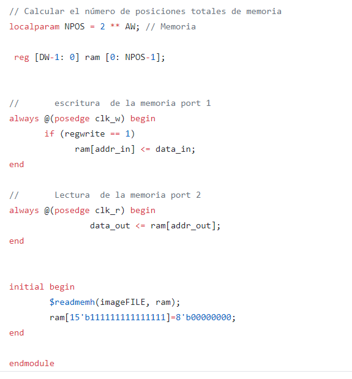

## Documentacion final
### Ericson Brayan Mesa Orjuela

### Oscar Mauricio Saavedra Gonzalez

### Sergio Andres Gerena Gomez

Esta documentacion evidencia el desarrollo de un sistema capaz de tomar una fotografia con una resolucion de 160x120 implementando una camara OV7670, una fpga para realizar el enlace de todos los modulos a razon de la captura y almacenamiento de la imagen, un arduino uno para cuadrar la configuracion de la camara, una pantalla con entrada VGA para poder mostrar la imagen y un boton para realizar la fotografia. A continuacion se muestra un esquema general del proyecto:

En el inicio de este proyecto, el primer modulo trabajado fue la memoria RAM, esta tenia que tener la capacidad de realizar el proceso de escritura y lectura de manera paralela, para eso se hizo necesario crear una memoria con dos "puertos" independientes, uno encargado de escribir en la memoria y otro de mostrar lo que hay guardado en la misma. Tambien tenemos en cuenta para la extencion de la RAM, la memoria disponible de la fpga Nexys 4 la cual es de 607500 Bytes, tambien debemos tener en cuenta el formato elegido para almacenar el pixel, este es el RGB 332, este formato guarda la informacion de un pixel en un Byte(8 bits), ademas la resolucion propuesta que es de 160 x120, para esto, en primera instancia debemos calcular los parametros AW(exponente para sacar las posiciones de memoria) y DW (cantidad de bits de los datos) dado para este problema, a continuacion se evidencia el procedimiento para ese calculo, seguido del codigo en el modulo de la RAM.

Como se sabe, DW es la cantidad de bits que ocupa el pixel, en este caso es 8, de esta manera podemos encontrar la cantidad total de bits que se consumira en la memoria RAM, dando el siguiente resultado:

esta seria la cantidad de bits que ocuparia la RAM, al compararla con la memoria maxima que disponemos, encontramos que esta  ocupa un 43,15%, dando espacio suficiente para que la FPGA tenga un buen espacio de memoria libre para funcionar correctamente. Una vez decidido los parametros para crear  el buffer RAM, presentamos el siguiente codigo:

En esta primera parte podemos apreciar los parametros hablados en la primera parte de este apartado, ademas de la imagen con la cual se inicializa la RAM, seguidamente tenemos iniciado los dos puertos de la memoria, en la primera parte tenemos el clock para escritura(PCLK de la camara) junto a un addres, un indicador para el dato a escribir y una señal que controla la escritura en la RAM, en la segunda parte de la seccion y de manera analoga tenemos los parametros para la lectura, es decir, un clock para delimitar el proceso de lectura de la RAM (se toma el de las pantallas VGA el cual es uno de una frecuancia de 25MHz), un addres y la informacion del bit a leer de la RAM.

