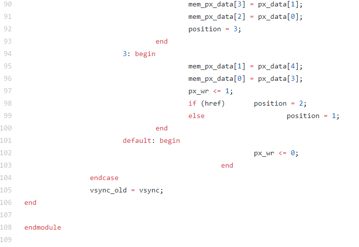

# Documentacion final
### Ericson Brayan Mesa Orjuela

### Oscar Mauricio Saavedra Gonzalez

### Sergio Andres Gerena Gomez

Esta documentacion evidencia el desarrollo de un sistema capaz de tomar una fotografia con una resolucion de 160x120 implementando una camara OV7670, una fpga para realizar el enlace de todos los modulos a razon de la captura y almacenamiento de la imagen, un arduino uno para cuadrar la configuracion de la camara, una pantalla con entrada VGA para poder mostrar la imagen y un boton para realizar la fotografia. A continuacion se muestra un esquema general del proyecto:

## Modulo Buffer_RAM_DP 

En el inicio de este proyecto, el primer modulo trabajado fue la memoria RAM, esta tenia que tener la capacidad de realizar el proceso de escritura y lectura de manera paralela, para eso se hizo necesario crear una memoria con dos "puertos" independientes, uno encargado de escribir en la memoria y otro de mostrar lo que hay guardado en la misma. Tambien tenemos en cuenta para la extencion de la RAM, la memoria disponible de la fpga Nexys 4 la cual es de 607500 Bytes, tambien debemos tener en cuenta el formato elegido para almacenar el pixel, este es el RGB 332, este formato guarda la informacion de un pixel en un Byte(8 bits), ademas la resolucion propuesta que es de 160 x120, para esto, en primera instancia debemos calcular los parametros AW(exponente para sacar las posiciones de memoria) y DW (cantidad de bits de los datos) dado para este problema, a continuacion se evidencia el procedimiento para ese calculo, seguido del codigo en el modulo de la RAM.

Como se sabe, DW es la cantidad de bits que ocupa el pixel, en este caso es 8, de esta manera podemos encontrar la cantidad total de bits que se consumira en la memoria RAM, dando el siguiente resultado:

esta seria la cantidad de bits que ocuparia la RAM, al compararla con la memoria maxima que disponemos, encontramos que esta  ocupa un 43,15%, dando espacio suficiente para que la FPGA tenga un buen espacio de memoria libre para funcionar correctamente. Una vez decidido los parametros para crear  el buffer RAM, presentamos el siguiente codigo:

En esta primera parte podemos apreciar los parametros hablados en la primera parte de este apartado, ademas de la imagen con la cual se inicializa la RAM, seguidamente tenemos iniciado los dos puertos de la memoria, en la primera parte tenemos el clock para escritura(PCLK de la camara) junto a un addres, un indicador para el dato a escribir y una señal que controla la escritura en la RAM, en la segunda parte de la seccion y de manera analoga tenemos los parametros para la lectura, es decir, un clock para delimitar el proceso de lectura de la RAM (se toma el de las pantallas VGA el cual es uno de una frecuancia de 25MHz), un addres y la informacion del bit a leer de la RAM.

En esta ultima seccion mostramos primeramente la creacion de la RAM, para ello usamos los parametros calculados anteriormente y encontramos el numero de posiciones de la memoria (NPOS) con este dato en la siguiente linea se genera la "matris" de memoria en la cual tenemos la RAM que consta de el numero de posiciones y en cada una de estas posiciones encontramos un Byte, es decir, un "ancho" de registro de 8 bits.

Las otras dos secciones son las de escritura y lectura de la RAM, en la primera se tiene dado en el flanco de subida del PCLK de la camara, tambien tenemos como condicion para que se escriba que la señal encargada de determinar cuando se escribe este valida, luego de comprobar esto se procede a almacenar el dato recibido por el modulo en el addres indicado; para el modulo de lectura se toma en cuenta con el reloj indicado de 25MHz, el cual simula el tiempo de lectura de las pantallas VGA, consecuente a esto esta la lectura del dato almacenado, de esta parte podemos concluir que constantemente se refresca la imagen en la pantalla VGA segun lo que se encuentre guardado en la RAM. La ultima parte es la inicializacion de la ram, en esta se almacena el archivo en la RAM, dejando el ultimo dato de la RAM de manera manual igualandola a 0.

## Módulo de Captura de Datos

Para desarrollar el módulo de captura de datos necesitamos 4 señales de entrada (entre ellas un bus de datos), estas señales provienen de la cámara OV7670 y son:

* Pclk
* Vsync
* Href
* Datos [7:0]

Las salidas del módulo son:

* datos [7:0] (la información de un pixel, es decir, en formato RGB332)
* addr [14:0] (indica la dirección asociada al pixel)
* Write (Registro de escritura)

Tal y como se observa en el siguiente diagrama o caja negra.

Se crearon 5 registros, dos son las señales de entrada y salida, uno la dirección que se asocia a cada pixel, el registro de escritura y un contador de 1 bit que nos indicará los datos a seleccionar de cada bus de datos que se recibe.

* RDatos [7:0] (registro de bus de entrada)
* Rdatos [7:0] (registro de bus de salida)
* Paddr [14:0] (dirección del bus de salida o pixel)
* RWrite (registro de escritura)
* count (inicializado con valor 0, indicará los datos que se deben tomar del bus de entrada)

Antes de seguir con el codigo, se hace indispensable explicar el proceso de Downsampling el cual es muy importante para la captura de datos, para esto sabemos que  la cámara nos envía un bus de datos de 8 bits (1 Byte), con 2 Bytes tenemos la información de un pixel en formato RGB565 como se ilustra en la siguiente tabla.

Byte 1  |  Byte 2
----------------|---------------
R R R R R G G G | G G G B B B B B
0 1 2 3 4 5 6 7 | 0 1 2 3 4 5 6 7

Para pasarlo a formato RGB332 se toman los datos más significativos de cada color. En el caso del primer Byte se dejaría de tomar los bits 3 y 4, mientras que en el caso del Byte 2 se toman los bits 3 y 4. Con el registro *count* se puede escoger que tipo de muestreo (sampling) se debe realizar, si el correspondiente al del primer Byte o al segundo Byte. De tal manera que nuestro dato de salida es 1 Byte por cada  2 Bytes de entrada.

Byte 1  |  Byte 2
----------------|---------------
R R R R R G G G | G G G B B B B B
0 1 2 X X 5 6 7 | X X X 3 4 X X X

Cada vez que se muestree uno de los Bytes se debe sumar +1 a *count*, ya que este es quien determina que se debe hacer el siguiente muestreo. *count* puede ser 0 o 1.  este proceso se presenta en el primer codigo de la siguiente manera:

En el primer codigo, tenemos en una primera parte un ciclo encargado de delimitar cuando realizar la captura de datos, esta en un principio se realiza cuando el valor de Vsync es 0, durante este tiempo se envia toda la informacion de la imagen, cada vez que se llega un nuevo bus de datos la direccion debe cambiar (Paddr=Paddr+1) y cuando se acabe de enviar todos los datos, debemos resetear el addres empleado para delimitar el pixel. esta seccion se muestra a continuacion.

Al evaluar este codigo en el simulador VGA, sale la siguiente imagen:

Como evidenciamos perfectamente en la imagen, en la primera prueba el modulo de captura mostro estar mal, ya que no arrojaba la figura que en teoria debia mostrar, vemos como pinta los dos frames de color rojo completamente. Al revisar el codigo de la captura de datos, podemos apreciar existe un error de sintaxis en el primer ciclo, al cerrar este antesde que pudiera entrar en la consicion del else, por consiguiente resulta que jamas actualiza realmente una posicion de memoria ni lleva la convercion de manera adecuda, por lo que siempre manda la informacion del rojo en toda la simulacion, luego de corregir el error presentado, se llego al siguiente codigo:

Con este cambio, al realizar otra vez la simulacion, obtenemos la siguiente imagen:

Como se puede apreciar, en este punto el resultado de la simulacion es la esperada en el planteamiento del Work03, una ves concordado eso, se procede a conectar la camara y una pantalla VGA para pasar a una prueba real de la captura de datos, despues de realizar el montaje se obtuvo el siguiente resultado:

Como podemos apreciar, se altera el color del fondo, cosa que indica que se esta realizando un guardado en la ultima posicion de memoria ademas de que la imagen en video se va corriendo, esto denota un problema en la sincronizacion, de aqui surge la pregunta de ¿por que funciona en la simulacion y no en la aplicacion real?, para responder esto, tenemos que abordar unos conceptos de como se realiza el proceso de captura de datos y describir un poco sobre la manera correcta de hacer este modulo.

Como podemos apreciar en la anterior imagen, enfocandonos en la relacion de los distintos clocks, comprendemos la razon por la que el codigo que se implemento hasta este punto esta mal. Vemos que el hecho de que Vsync este en 0 no es lo unico  para comenzar a tomar datos y por consiguiente alterar el addres del pixel, observamos siempre un delay importante entre el Vsync y el Href, este delay es el tiempo necesario para la camara enviar el dato correcto en la fila correcta, y aunque a primera instancia pareciera cumplirse esto en el downsampling, vemos que no lo hace en la seccion que altera el addres del pixel, esta parte es la que hace que la imagen se corra. Otra cosa a mejorar en el codigo es el manejo de los casos presentes a lo hora de tomar en cuenta la captura de datos, por consiguiente y por facilidad de agregar la opcion del boton, ademas de brindar versatilidad al codigo, se empleo una maquina de estados la cual se muestra a continuacion:

Con esto en mente, tenemos el siguiente cambio en el codigo de lectura de la camara:

Como se puede apreciar, aun no se tiene implementado el boton para realizar la fotografia, esto se debe a la necesidad de primero mejorar la imagen como tal para poder mejorar la captura primero. Este codigo genero la siguiente respuesta:

Aca podemos apreciar que aunque la imagen como tal este bien y ya no se desplace, vemos comos los colores no cuadran con la realidad, ademas de presentar un color de fondo que no deberia de ser, esto da a entender que existe un problema con la captura de datos, ya que de cierta manera los colores dados no corresponden y se guarda informacion en posiciones que deberian ser reservadas, al ver estos errores se decidio implementar el boton para completar el esquema y aterar las condiciones de cada uno de los casos, ademas de agregar contadores para los Href y pixels de tal forma que se pueda hacer un seguimiento mas detallado a los datos que se almacenan y a las decisiones tomadas en cada uno de los estados, asi, el codigo corregido en este aspecto queda de la siguiente manera:

Este codigo ya contempla mas la maquina de estados mostrada anteriormente (la cual es la maquina final del codigo) y soluciona los problemas condicionales ademas de mostrar el boton como parte de todo el codigo, pero al probarlo se puede apreciar una pequeña particularidad que se constrasta en el vide presentado a continuacion; en dicho video se logra ver como la imagen en la parte izquierda aparece partida completamente, dividiendo la imagen, esto claramente es muestra de que los pixeles no estan siendo guardados correctamente, sin embargo el problema del fondo y los colores fue arreglado, la imagen oscura es debido a la configuracion de brillo en el arduino:

Para intentar corregir este error se realizaron ciertos cambios en el codigo, estos genera el codigo mostrado a continuacion:

Pero lejos de arreglarlo, solo genera un corrimiento diagonal, ya que aumenta el desvio de la linea negra, haciendo mas evidente que se cuentan menos pixeles por fila como se evidencia a continuacion.

Aunque el boton funciona y el resto se encuentra ya funcionando desde hace mucho (la implementacion del boton en el codigo) buscamos terminar de optimizar el codigo y ver como solucionar el problema de la linea, el codigo final que logro concluir todo esto fue el siguiente:

